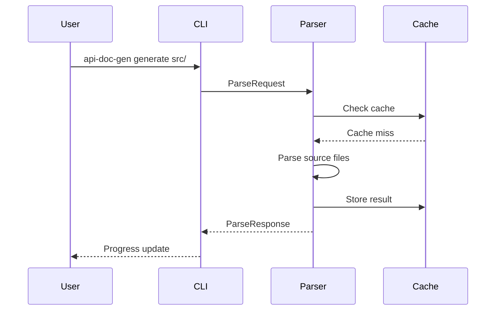
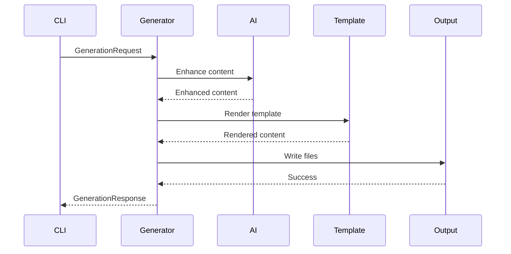

# Architecture Guide

This document provides a comprehensive overview of the API Documentation Generator's architecture, design decisions, and technical implementation details.

## Table of Contents

- [Overview](#overview)
- [System Architecture](#system-architecture)
- [Core Components](#core-components)
- [Data Flow](#data-flow)
- [Parser System](#parser-system)
- [AI Integration](#ai-integration)
- [Template System](#template-system)
- [Caching System](#caching-system)
- [Error Handling](#error-handling)
- [Performance Considerations](#performance-considerations)
- [Security Architecture](#security-architecture)
- [Extension Points](#extension-points)

## Overview

The API Documentation Generator is built as a modular, extensible system that can parse various input sources and generate comprehensive documentation in multiple formats. The architecture follows clean architecture principles with clear separation of concerns.

### Design Principles

- **Modularity**: Each component has a single responsibility
- **Extensibility**: Easy to add new parsers, generators, and templates
- **Performance**: Optimized for large codebases and concurrent processing
- **Reliability**: Comprehensive error handling and validation
- **Maintainability**: Clean code with comprehensive testing

## System Architecture

```mermaid
graph TB
    CLI[CLI Interface] --> Parser[Parser Service]
    CLI --> Generator[Generation Service]
    CLI --> Config[Configuration Manager]
    
    Parser --> ExpressParser[Express Parser]
    Parser --> JSDocParser[JSDoc Parser]
    Parser --> OpenAPIParser[OpenAPI Parser]
    Parser --> PythonParser[Python Parser]
    Parser --> GoParser[Go Parser]
    
    Generator --> AIService[AI Service]
    Generator --> TemplateEngine[Template Engine]
    Generator --> CacheManager[Cache Manager]
    
    AIService --> OpenAI[OpenAI GPT-4]
    AIService --> Claude[Anthropic Claude]
    
    TemplateEngine --> Handlebars[Handlebars Templates]
    TemplateEngine --> Themes[Custom Themes]
    
    CacheManager --> MemoryCache[Memory Cache]
    CacheManager --> FileCache[File Cache]
    
    Generator --> HTML[HTML Output]
    Generator --> Markdown[Markdown Output]
    Generator --> PDF[PDF Output]
    Generator --> JSON[JSON Output]
    Generator --> UML[UML Diagrams]
    
    Gateway[API Gateway] --> REST[REST APIs]
    Gateway --> GraphQL[GraphQL]
    Gateway --> WebSocket[WebSocket]
    
    Monitor[Performance Monitor] --> Metrics[Metrics Collection]
    Monitor --> Alerts[Alerting System]
```



## Core Components

### 1. CLI Interface (`src/cli/`)

The command-line interface provides the primary user interaction point.

**Key Files:**
- `index.ts` - Main CLI application
- `cli-service.ts` - CLI service implementation
- `commands/` - Individual command implementations

**Responsibilities:**
- Command parsing and validation
- User interaction and feedback
- Session management
- Configuration loading
- Progress reporting

```typescript
interface CLIApp {
  execute(args: string[]): Promise<void>;
  showHelp(): void;
  showVersion(): void;
}
```

### 2. Parser Service (`src/parsers/`)

The parser service is responsible for converting various input sources into a standardized format.

**Key Files:**
- `parser-service.ts` - Main parser service
- `languages/` - Language-specific parsers
  - `express-parser.ts` - Express.js route parser
  - `jsdoc-parser.ts` - JSDoc comment parser
  - `openapi-parser.ts` - OpenAPI specification parser
  - `python-parser.ts` - Python docstring parser
  - `go-parser.ts` - Go documentation parser

**Responsibilities:**
- Source code parsing
- AST generation
- Validation and error reporting
- Reference resolution
- Schema extraction

```typescript
interface IParser {
  readonly type: string;
  readonly supportedExtensions: string[];
  
  parse(request: ParseRequest): Promise<ParseResponse>;
  validate(ast: StandardizedAST): Promise<ValidationResponse>;
}
```

### 3. Generation Service (`src/generators/`)

The generation service converts parsed data into documentation formats.

**Key Files:**
- `generation-service.ts` - Main generation service
- `html-generator.ts` - HTML output generator
- `markdown-generator.ts` - Markdown output generator
- `pdf-generator.ts` - PDF output generator
- `json-generator.ts` - JSON output generator

**Responsibilities:**
- Template rendering
- Format conversion
- Output generation
- File management
- Progress tracking

### 4. AI Service (`src/ai/`)

The AI service provides intelligent content enhancement and generation.

**Key Files:**
- `ai-service.ts` - Main AI service
- `ai-service-factory.ts` - AI provider factory
- `providers/` - AI provider implementations

**Responsibilities:**
- Content enhancement
- Summarization
- Description generation
- Quality improvement
- Provider management

```typescript
interface AIService {
  enhanceContent(content: string, options: EnhancementOptions): Promise<string>;
  generateSummary(data: any): Promise<string>;
  improveDescription(description: string): Promise<string>;
}
```

### 5. Cache Manager (`src/cache/`)

The cache manager provides intelligent caching for improved performance.

**Key Files:**
- `cache-manager.ts` - Main cache manager
- `memory-cache.ts` - In-memory cache implementation
- `file-cache.ts` - File-based cache implementation

**Responsibilities:**
- Cache management
- Invalidation strategies
- Performance optimization
- Storage management

### 6. Configuration Manager (`src/config/`)

The configuration manager handles all configuration aspects.

**Key Files:**
- `config-manager.ts` - Main configuration manager
- `config-validator.ts` - Configuration validation

**Responsibilities:**
- Configuration loading
- Validation
- Default values
- Environment variables
- User preferences

## Data Flow

### 1. Input Processing



### 2. Generation Process



## Parser System

### Parser Architecture

The parser system uses a plugin architecture where each parser implements the `IParser` interface.

```typescript
interface IParser {
  readonly type: string;
  readonly supportedExtensions: string[];
  
  parse(request: ParseRequest): Promise<ParseResponse>;
  validate(ast: StandardizedAST): Promise<ValidationResponse>;
}
```

### Express.js Parser

The Express.js parser is a key component that directly parses Express.js route files.

**Features:**
- Route detection (`app.get()`, `router.post()`, etc.)
- Parameter extraction (`:id`, `:userId`)
- Middleware detection
- Error handler identification
- File location tracking

**Implementation:**
```typescript
class ExpressParser implements IParser {
  readonly type = 'express';
  readonly supportedExtensions = ['.js', '.ts', '.jsx', '.tsx'];
  
  async parse(request: ParseRequest): Promise<ParseResponse> {
    const source = await this.loadSource(request);
    const ast = this.parseSource(source, request.path);
    return this.convertToAST(ast, request);
  }
  
  private parseSource(source: string, filePath: string): ExpressApp {
    // TypeScript AST parsing implementation
  }
}
```

### Parser Registry

The parser service maintains a registry of available parsers:

```typescript
class ParserService {
  private registry = new Map<string, IParser>();
  
  async initialize(): Promise<void> {
    // Register all available parsers
    this.registry.set('express', new ExpressParser());
    this.registry.set('jsdoc', new JSDocParser());
    this.registry.set('openapi', new OpenAPIParser());
    // ... other parsers
  }
}
```

## AI Integration

### AI Service Architecture

The AI service provides a unified interface for multiple AI providers.

```typescript
interface AIService {
  enhanceContent(content: string, options: EnhancementOptions): Promise<string>;
  generateSummary(data: any): Promise<string>;
  improveDescription(description: string): Promise<string>;
}
```

### Provider Factory

The AI service uses a factory pattern to support multiple providers:

```typescript
class AIServiceFactory {
  static create(provider: string, config: AIConfig): AIService {
    switch (provider) {
      case 'openai':
        return new OpenAIService(config);
      case 'claude':
        return new ClaudeService(config);
      default:
        throw new Error(`Unsupported AI provider: ${provider}`);
    }
  }
}
```

### Content Enhancement

The AI service enhances documentation content through:

1. **Summarization**: Generate concise summaries
2. **Description Improvement**: Enhance parameter descriptions
3. **Example Generation**: Create usage examples
4. **Quality Enhancement**: Improve overall content quality

## Template System

### Template Architecture

The template system uses Handlebars for flexible template rendering.

```typescript
interface TemplateEngine {
  render(template: string, data: any): Promise<string>;
  registerPartial(name: string, template: string): void;
  registerHelper(name: string, helper: Function): void;
}
```

### Template Structure

```
templates/
├── html/
│   ├── main.hbs          # Main template
│   ├── partials/         # Template partials
│   │   ├── header.hbs
│   │   ├── navigation.hbs
│   │   └── footer.hbs
│   └── themes/           # Theme-specific templates
│       ├── default/
│       ├── modern/
│       └── minimal/
├── markdown/
│   └── main.hbs
└── pdf/
    └── main.hbs
```

### Custom Templates

Users can create custom templates:

```handlebars
{{!-- templates/custom.hbs --}}
<!DOCTYPE html>
<html>
<head>
    <title>{{project.name}} - API Documentation</title>
    <style>
        /* Custom styles */
    </style>
</head>
<body>
    <header>
        <h1>{{project.name}}</h1>
        <p>{{project.description}}</p>
    </header>
    
    <main>
        {{#each endpoints}}
            <section class="endpoint">
                <h2>{{method}} {{path}}</h2>
                <p>{{description}}</p>
                {{#if parameters}}
                    <h3>Parameters</h3>
                    <ul>
                        {{#each parameters}}
                            <li><strong>{{name}}</strong> ({{type}}) - {{description}}</li>
                        {{/each}}
                    </ul>
                {{/if}}
            </section>
        {{/each}}
    </main>
</body>
</html>
```

## Caching System

### Cache Architecture

The caching system provides multiple caching strategies:

```typescript
interface CacheManager {
  get(key: string): Promise<any>;
  set(key: string, value: any, ttl?: number): Promise<void>;
  delete(key: string): Promise<void>;
  clear(): Promise<void>;
  has(key: string): Promise<boolean>;
}
```

### Cache Strategies

1. **Memory Cache**: Fast in-memory caching
2. **File Cache**: Persistent file-based caching
3. **Hybrid Cache**: Combination of memory and file caching

### Cache Keys

Cache keys are generated based on:
- Source file content hash
- Parser type
- Configuration hash
- Template hash

```typescript
function generateCacheKey(source: string, parserType: string, config: any): string {
  const sourceHash = crypto.createHash('md5').update(source).digest('hex');
  const configHash = crypto.createHash('md5').update(JSON.stringify(config)).digest('hex');
  return `${parserType}:${sourceHash}:${configHash}`;
}
```

## Error Handling

### Error Architecture

The system uses a comprehensive error handling strategy:

```typescript
class APIError extends Error {
  constructor(
    message: string,
    public code: string,
    public statusCode: number = 500,
    public details?: any
  ) {
    super(message);
    this.name = 'APIError';
  }
}
```

### Error Types

1. **ParseError**: Parsing-related errors
2. **ValidationError**: Validation failures
3. **GenerationError**: Generation process errors
4. **ConfigurationError**: Configuration issues
5. **AIServiceError**: AI service errors

### Error Recovery

The system implements error recovery strategies:

1. **Graceful Degradation**: Continue processing other files
2. **Retry Logic**: Retry failed operations
3. **Fallback Mechanisms**: Use alternative approaches
4. **User Notification**: Inform users of issues

## Performance Considerations

### Optimization Strategies

1. **Concurrent Processing**: Parallel file processing
2. **Caching**: Intelligent caching for repeated operations
3. **Lazy Loading**: Load resources only when needed
4. **Memory Management**: Efficient memory usage
5. **Streaming**: Stream large files instead of loading entirely

### Performance Monitoring

The system includes comprehensive performance monitoring:

```typescript
interface PerformanceMonitor {
  startTimer(name: string): void;
  endTimer(name: string): number;
  recordMetric(name: string, value: number): void;
  getMetrics(): PerformanceMetrics;
}
```

### Scalability

The architecture supports horizontal scaling through:

1. **Stateless Design**: No shared state between requests
2. **Load Balancing**: Distribute load across instances
3. **Caching**: Reduce backend load
4. **Async Processing**: Non-blocking operations

## Security Architecture

### Security Measures

1. **Input Validation**: Validate all inputs
2. **Output Sanitization**: Sanitize generated content
3. **Authentication**: API key authentication
4. **Authorization**: Role-based access control
5. **Rate Limiting**: Prevent abuse
6. **CORS**: Cross-origin resource sharing

### Security Headers

```typescript
app.use(helmet({
  contentSecurityPolicy: {
    directives: {
      defaultSrc: ["'self'"],
      styleSrc: ["'self'", "'unsafe-inline'"],
      scriptSrc: ["'self'"],
    },
  },
  hsts: {
    maxAge: 31536000,
    includeSubDomains: true,
  }
}));
```

## Extension Points

### Plugin Architecture

The system provides several extension points:

1. **Custom Parsers**: Add new input source parsers
2. **Custom Generators**: Add new output formats
3. **Custom Templates**: Create custom templates
4. **Custom AI Providers**: Add new AI services
5. **Custom Cache Strategies**: Implement new caching approaches

### Extension Example

```typescript
// Custom parser example
class CustomParser implements IParser {
  readonly type = 'custom';
  readonly supportedExtensions = ['.custom'];
  
  async parse(request: ParseRequest): Promise<ParseResponse> {
    // Custom parsing logic
  }
}

// Register custom parser
const parserService = new ParserService();
parserService.register('custom', new CustomParser());
```

## Future Considerations

### Planned Enhancements

1. **GraphQL Support**: Enhanced GraphQL schema parsing
2. **Real-time Collaboration**: Collaborative documentation editing
3. **Version Control Integration**: Git integration for documentation
4. **Advanced Analytics**: Usage analytics and insights
5. **Plugin Marketplace**: Community plugin ecosystem

### Technical Debt

1. **Legacy Code**: Gradual migration of legacy components
2. **Test Coverage**: Improve test coverage for edge cases
3. **Documentation**: Enhance inline documentation
4. **Performance**: Optimize slow operations
5. **Security**: Regular security audits and updates

---

This architecture guide provides a comprehensive overview of the API Documentation Generator's technical implementation. For more specific implementation details, refer to the source code and individual component documentation.
