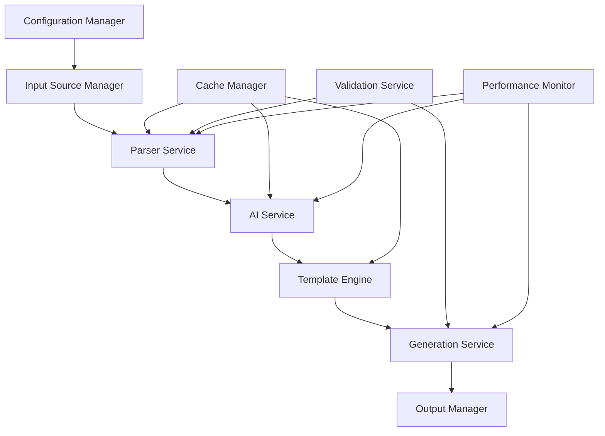
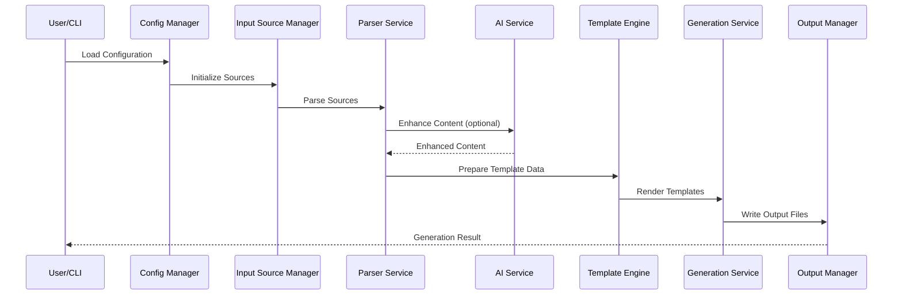
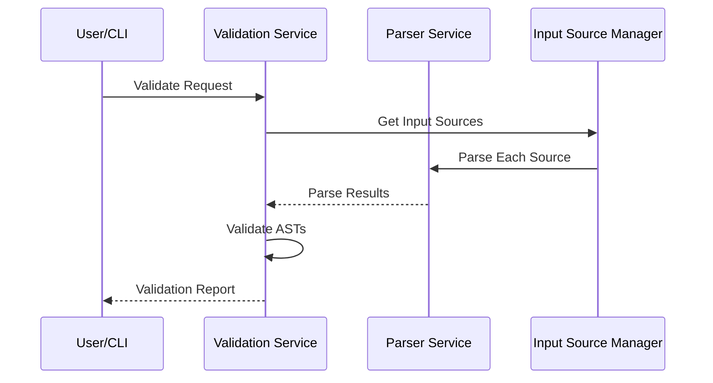
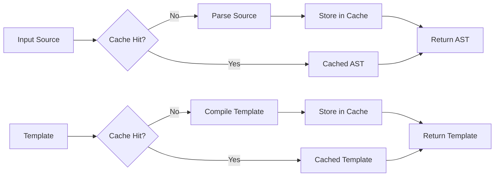

# Architecture Documentation

> ⚠️ **Runtime Platform Constraint**  
> Architectural descriptions reflect a Windows-only support model. Any references to cross-platform abstractions are historical and not commitments to non-Windows compatibility.

## Table of Contents

- [System Overview](#system-overview)
- [Core Architecture](#core-architecture)
- [Component Design](#component-design)
- [Data Flow](#data-flow)
- [Service Layer](#service-layer)
- [Performance Architecture](#performance-architecture)
- [Security Architecture](#security-architecture)
- [Deployment Architecture](#deployment-architecture)
- [Design Patterns](#design-patterns)
- [Extension Points](#extension-points)

## System Overview

The API Documentation Generator is designed as a modular, extensible system that can process multiple input sources and generate documentation in various output formats. The architecture follows clean architecture principles with clear separation of concerns.

```
┌─────────────────────────────────────────────────────────────┐
│                    API Documentation Generator              │
├─────────────────────────────────────────────────────────────┤
│  CLI Interface  │  Web API  │  Programmatic API            │
├─────────────────────────────────────────────────────────────┤
│                    Application Layer                        │
│  ┌─────────────┐  ┌─────────────┐  ┌─────────────┐         │
│  │ Generation  │  │ Validation  │  │ Diff        │         │
│  │ Service     │  │ Service     │  │ Service     │         │
│  └─────────────┘  └─────────────┘  └─────────────┘         │
├─────────────────────────────────────────────────────────────┤
│                    Domain Layer                             │
│  ┌─────────────┐  ┌─────────────┐  ┌─────────────┐         │
│  │ Parser      │  │ AI          │  │ Template    │         │
│  │ Service     │  │ Service     │  │ Engine      │         │
│  └─────────────┘  └─────────────┘  └─────────────┘         │
├─────────────────────────────────────────────────────────────┤
│                    Infrastructure Layer                     │
│  ┌─────────────┐  ┌─────────────┐  ┌─────────────┐         │
│  │ File        │  │ Cache       │  │ Configuration│         │
│  │ System      │  │ Manager     │  │ Manager     │         │
│  └─────────────┘  └─────────────┘  └─────────────┘         │
└─────────────────────────────────────────────────────────────┘
```

### Key Design Principles

1. **Modularity**: Each component has a single responsibility and can be developed/tested independently
2. **Extensibility**: New parsers, generators, and output formats can be added without modifying core logic
3. **Performance**: Concurrent processing, intelligent caching, and memory-efficient operations
4. **Reliability**: Comprehensive error handling, validation, and recovery mechanisms
5. **Maintainability**: Clean code, comprehensive tests, and clear documentation

## Core Architecture

### Layer Responsibilities

#### 1. Interface Layer
- **CLI Interface**: Command-line interface for user interactions
- **Web API**: RESTful API for programmatic access
- **Programmatic API**: Direct library usage from TypeScript/JavaScript

#### 2. Application Layer
- **Orchestration**: Coordinates workflows between services
- **Use Cases**: Implements business logic for generation, validation, and diffing
- **Error Handling**: Manages errors and provides user-friendly messages

#### 3. Domain Layer
- **Core Business Logic**: Parser management, AI integration, template processing
- **Domain Models**: API specifications, input sources, generation configurations
- **Service Interfaces**: Defines contracts for all services

#### 4. Infrastructure Layer
- **External Integrations**: File system, AI services, cache storage
- **Cross-cutting Concerns**: Logging, monitoring, configuration management

## Component Design

### Core Components



### Configuration Manager

**Responsibility**: Manages application configuration from multiple sources

```typescript
class ConfigurationManager {
  private config: GenerationConfig;
  private watchers: FileWatcher[];
  
  // Load configuration from file
  async loadConfig(path: string): Promise<GenerationConfig>
  
  // Merge configurations from multiple sources
  mergeConfigs(...configs: Partial<GenerationConfig>[]): GenerationConfig
  
  // Validate configuration
  validateConfig(config: GenerationConfig): ValidationResult
  
  // Watch for configuration changes
  watchConfig(callback: (config: GenerationConfig) => void): void
}
```

**Key Features**:
- Multi-source configuration (files, environment variables, CLI arguments)
- Hot-reloading of configuration changes
- Schema validation and error reporting
- Environment-specific overrides

### Input Source Manager

**Responsibility**: Manages and coordinates input sources

```typescript
class InputSourceManager {
  private sources: Map<string, InputSource>;
  private processors: Map<InputSourceType, SourceProcessor>;
  
  // Register input source
  registerSource(source: InputSource): void
  
  // Get sources by priority
  getSourcesByPriority(): InputSource[]
  
  // Process all sources
  async processAll(): Promise<ProcessingResult[]>
  
  // Process specific sources
  async processSelected(sourceIds: string[]): Promise<ProcessingResult[]>
}
```

**Key Features**:
- Priority-based processing
- Parallel source processing
- Source state management
- Error isolation between sources

### Parser Service

**Responsibility**: Parses various input source types into standardized ASTs

```typescript
interface IParserService {
  // Register parser for specific type
  registerParser(type: InputSourceType, parser: IParser): void
  
  // Parse input source
  parse(source: InputSource): Promise<ParseResult>
  
  // Get parser for type
  getParser(type: InputSourceType): IParser | undefined
  
  // Check if type is supported
  isSupported(type: InputSourceType): boolean
}

interface IParser {
  // Parse source content
  parse(content: string, options: ParseOptions): Promise<ParseResult>
  
  // Validate parsed content
  validate(ast: any): ValidationResult
  
  // Extract documentation
  extract(ast: any): ExtractionResult
}
```

**Supported Parsers**:
- **OpenAPI Parser**: OpenAPI 3.0/3.1 and Swagger 2.0 specifications
- **TypeScript Parser**: JSDoc comments and type definitions
- **JavaScript Parser**: JSDoc comments and function signatures
- **Python Parser**: Docstrings and type hints
- **Go Parser**: Go doc comments and function signatures

### AI Service

**Responsibility**: Provides AI-enhanced documentation capabilities

```typescript
class AIService {
  private provider: IAIProvider;
  private rateLimiter: RateLimiter;
  private batchProcessor: BatchProcessor;
  
  // Enhance documentation content
  async enhance(content: string, options: AIEnhancementOptions): Promise<AIResult>
  
  // Generate documentation summaries
  async summarize(content: string, options: AISummaryOptions): Promise<AIResult>
  
  // Batch process multiple requests
  async batchProcess(requests: AIRequest[]): Promise<AIBatchResult>
  
  // Check service health
  async healthCheck(): Promise<AIHealthResult>
}

interface IAIProvider {
  name: string;
  models: string[];
  
  // Send request to AI service
  request(prompt: string, options: AIRequestOptions): Promise<AIResponse>
  
  // Batch requests
  batchRequest(prompts: string[], options: AIRequestOptions): Promise<AIResponse[]>
}
```

**AI Providers**:
- **OpenAI Provider**: GPT-3.5, GPT-4 models
- **Anthropic Provider**: Claude models
- **Local Provider**: Local AI models via API

### Template Engine

**Responsibility**: Renders documentation using customizable templates

```typescript
class TemplateEngine {
  private handlebars: Handlebars;
  private templateCache: Map<string, CompiledTemplate>;
  private helpers: Map<string, HelperFunction>;
  
  // Register template helper
  registerHelper(name: string, helper: HelperFunction): void
  
  // Compile template
  compile(template: string): CompiledTemplate
  
  // Render template with data
  render(template: string, data: any): string
  
  // Load template from file
  loadTemplate(path: string): Promise<CompiledTemplate>
}
```

**Template Features**:
- Handlebars-based templating
- Custom helper functions
- Template inheritance and partials
- Multi-format support (HTML, Markdown, LaTeX)

### Generation Service

**Responsibility**: Orchestrates the documentation generation process

```typescript
class GenerationService {
  private templateEngine: TemplateEngine;
  private outputManager: OutputManager;
  private performanceMonitor: PerformanceMonitor;
  
  // Generate documentation
  async generate(request: GenerationRequest): Promise<GenerationResult>
  
  // Generate preview
  async preview(request: PreviewRequest): Promise<PreviewResult>
  
  // Batch generate
  async batchGenerate(requests: GenerationRequest[]): Promise<BatchResult>
  
  // Get available templates
  getTemplates(): TemplateInfo[]
}
```

## Data Flow

### Generation Workflow



### Validation Workflow



### Caching Strategy



## Service Layer

### Service Dependencies

```typescript
// Dependency injection container
class ServiceContainer {
  private services: Map<string, any>;
  private singletons: Map<string, any>;
  
  // Register service
  register<T>(name: string, factory: () => T): void
  
  // Register singleton service
  registerSingleton<T>(name: string, factory: () => T): void
  
  // Resolve service
  resolve<T>(name: string): T
  
  // Create service graph
  createServiceGraph(): ServiceGraph
}

// Service lifecycle management
class ServiceManager {
  private container: ServiceContainer;
  private lifecycle: ServiceLifecycle;
  
  // Initialize all services
  async initialize(): Promise<void>
  
  // Shutdown all services
  async shutdown(): Promise<void>
  
  // Health check all services
  async healthCheck(): Promise<HealthStatus>
}
```

### Service Interfaces

```typescript
interface IService {
  name: string;
  version: string;
  
  // Initialize service
  initialize(): Promise<void>;
  
  // Shutdown service
  shutdown(): Promise<void>;
  
  // Health check
  healthCheck(): Promise<ServiceHealth>;
}

interface ServiceHealth {
  status: 'healthy' | 'degraded' | 'unhealthy';
  message?: string;
  lastCheck: Date;
  dependencies?: ServiceHealth[];
}
```

## Performance Architecture

### Concurrent Processing

```typescript
class ConcurrencyManager {
  private maxConcurrency: number;
  private activeJobs: Set<string>;
  private jobQueue: PriorityQueue<Job>;
  
  // Execute job with concurrency control
  async execute<T>(job: Job<T>): Promise<T>
  
  // Execute jobs in parallel
  async executeAll<T>(jobs: Job<T>[]): Promise<T[]>
  
  // Monitor concurrency metrics
  getMetrics(): ConcurrencyMetrics
}

interface Job<T> {
  id: string;
  priority: number;
  timeout: number;
  execute(): Promise<T>;
}
```

### Memory Management

```typescript
class MemoryManager {
  private maxHeapSize: number;
  private gcThreshold: number;
  private memoryMonitor: MemoryMonitor;
  
  // Monitor memory usage
  getMemoryUsage(): MemoryUsage
  
  // Force garbage collection
  forceGC(): void
  
  // Check memory pressure
  isMemoryPressure(): boolean
  
  // Setup memory alerts
  setupAlerts(callback: (alert: MemoryAlert) => void): void
}
```

### Caching Architecture

```typescript
class CacheManager {
  private stores: Map<string, ICacheStore>;
  private policies: Map<string, CachePolicy>;
  
  // Get cached value
  async get<T>(key: string, store?: string): Promise<T | undefined>
  
  // Set cached value
  async set<T>(key: string, value: T, ttl?: number, store?: string): Promise<void>
  
  // Clear cache
  async clear(pattern?: string, store?: string): Promise<void>
  
  // Cache statistics
  getStats(): CacheStats
}

interface ICacheStore {
  get<T>(key: string): Promise<T | undefined>;
  set<T>(key: string, value: T, ttl?: number): Promise<void>;
  delete(key: string): Promise<void>;
  clear(): Promise<void>;
  size(): Promise<number>;
}
```

## Security Architecture

### Input Validation

```typescript
class InputValidator {
  private schemas: Map<string, ValidationSchema>;
  private sanitizers: Map<string, SanitizerFunction>;
  
  // Validate input against schema
  validate(input: any, schemaName: string): ValidationResult
  
  // Sanitize input
  sanitize(input: any, sanitizerName: string): any
  
  // Register custom validator
  registerValidator(name: string, validator: ValidatorFunction): void
}
```

### Security Policies

1. **Input Sanitization**: All user inputs are validated and sanitized
2. **Path Traversal Protection**: File paths are validated to prevent directory traversal
3. **Template Security**: Templates are sandboxed to prevent code execution
4. **AI Content Filtering**: AI-generated content is filtered for security issues
5. **Dependency Scanning**: Regular scanning for vulnerable dependencies

### Access Control

```typescript
class AccessController {
  private policies: AccessPolicy[];
  private roles: Map<string, Role>;
  
  // Check access permission
  checkAccess(resource: string, action: string, context: AccessContext): boolean
  
  // Validate API key
  validateApiKey(apiKey: string): Promise<AuthResult>
  
  // Rate limiting
  checkRateLimit(identifier: string): Promise<RateLimitResult>
}
```

## Deployment Architecture

### Container Architecture

```dockerfile
# Multi-stage Docker build
FROM node:18-alpine AS builder
WORKDIR /app
COPY package*.json ./
RUN npm ci --only=production

FROM node:18-alpine AS runtime
WORKDIR /app
COPY --from=builder /app/node_modules ./node_modules
COPY . .
RUN npm run build

EXPOSE 3000
CMD ["npm", "start"]
```

### Kubernetes Deployment

```yaml
apiVersion: apps/v1
kind: Deployment
metadata:
  name: api-doc-generator
spec:
  replicas: 3
  selector:
    matchLabels:
      app: api-doc-generator
  template:
    metadata:
      labels:
        app: api-doc-generator
    spec:
      containers:
      - name: api-doc-generator
        image: api-doc-generator:latest
        ports:
        - containerPort: 3000
        env:
        - name: NODE_ENV
          value: "production"
        - name: CACHE_REDIS_URL
          value: "redis://redis-service:6379"
        resources:
          limits:
            memory: "2Gi"
            cpu: "1000m"
          requests:
            memory: "1Gi"
            cpu: "500m"
```

### Scalability Patterns

1. **Horizontal Scaling**: Multiple instances behind load balancer
2. **Microservices**: Split into specialized services (parser, generator, AI)
3. **Event-Driven Architecture**: Async processing with message queues
4. **Edge Computing**: Deploy generators closer to source repositories

## Design Patterns

### Factory Pattern

```typescript
// Parser factory for creating parsers based on input type
class ParserFactory {
  private static parsers: Map<InputSourceType, () => IParser> = new Map();
  
  static registerParser(type: InputSourceType, factory: () => IParser): void {
    this.parsers.set(type, factory);
  }
  
  static createParser(type: InputSourceType): IParser {
    const factory = this.parsers.get(type);
    if (!factory) {
      throw new Error(`No parser registered for type: ${type}`);
    }
    return factory();
  }
}
```

### Observer Pattern

```typescript
// Event-driven architecture for service communication
class EventBus {
  private listeners: Map<string, EventListener[]> = new Map();
  
  subscribe(event: string, listener: EventListener): void {
    const eventListeners = this.listeners.get(event) || [];
    eventListeners.push(listener);
    this.listeners.set(event, eventListeners);
  }
  
  emit(event: string, data: any): void {
    const eventListeners = this.listeners.get(event) || [];
    eventListeners.forEach(listener => listener(data));
  }
}
```

### Strategy Pattern

```typescript
// Template rendering strategies for different output formats
interface IRenderingStrategy {
  render(data: any, template: string): Promise<string>;
}

class HtmlRenderingStrategy implements IRenderingStrategy {
  async render(data: any, template: string): Promise<string> {
    // HTML-specific rendering logic
  }
}

class MarkdownRenderingStrategy implements IRenderingStrategy {
  async render(data: any, template: string): Promise<string> {
    // Markdown-specific rendering logic
  }
}

class TemplateRenderer {
  private strategy: IRenderingStrategy;
  
  setStrategy(strategy: IRenderingStrategy): void {
    this.strategy = strategy;
  }
  
  async render(data: any, template: string): Promise<string> {
    return this.strategy.render(data, template);
  }
}
```

### Command Pattern

```typescript
// Command pattern for CLI operations
interface ICommand {
  execute(): Promise<void>;
  undo(): Promise<void>;
}

class GenerateCommand implements ICommand {
  constructor(private config: GenerationConfig) {}
  
  async execute(): Promise<void> {
    // Execute generation
  }
  
  async undo(): Promise<void> {
    // Cleanup generated files
  }
}

class CommandInvoker {
  private history: ICommand[] = [];
  
  async executeCommand(command: ICommand): Promise<void> {
    await command.execute();
    this.history.push(command);
  }
  
  async undoLastCommand(): Promise<void> {
    const command = this.history.pop();
    if (command) {
      await command.undo();
    }
  }
}
```

## Extension Points

### Plugin Architecture

```typescript
interface IPlugin {
  name: string;
  version: string;
  
  // Plugin lifecycle
  initialize(context: PluginContext): Promise<void>;
  shutdown(): Promise<void>;
  
  // Plugin capabilities
  getCapabilities(): PluginCapability[];
}

interface PluginContext {
  config: GenerationConfig;
  services: ServiceContainer;
  eventBus: EventBus;
  logger: ILogger;
}

class PluginManager {
  private plugins: Map<string, IPlugin> = new Map();
  
  // Load plugin
  async loadPlugin(pluginPath: string): Promise<void>
  
  // Unload plugin
  async unloadPlugin(pluginName: string): Promise<void>
  
  // Get loaded plugins
  getLoadedPlugins(): IPlugin[]
  
  // Plugin discovery
  discoverPlugins(directory: string): Promise<string[]>
}
```

### Custom Parser Registration

```typescript
// Register custom parser for new input types
class CustomMarkdownParser implements IParser {
  async parse(content: string, options: ParseOptions): Promise<ParseResult> {
    // Custom parsing logic for markdown with special annotations
  }
  
  validate(ast: any): ValidationResult {
    // Custom validation logic
  }
  
  extract(ast: any): ExtractionResult {
    // Custom extraction logic
  }
}

// Register the parser
ParserFactory.registerParser(InputSourceType.CUSTOM_MARKDOWN, () => new CustomMarkdownParser());
```

### Custom Template Helpers

```typescript
// Register custom Handlebars helpers
TemplateEngine.registerHelper('formatCurrency', (amount: number, currency: string) => {
  return new Intl.NumberFormat('en-US', {
    style: 'currency',
    currency: currency
  }).format(amount);
});

TemplateEngine.registerHelper('httpMethodColor', (method: string) => {
  const colors = {
    GET: 'green',
    POST: 'blue',
    PUT: 'orange',
    DELETE: 'red',
    PATCH: 'purple'
  };
  return colors[method.toUpperCase()] || 'gray';
});
```

### Custom AI Providers

```typescript
class CustomAIProvider implements IAIProvider {
  name = 'custom-ai';
  models = ['custom-model-v1', 'custom-model-v2'];
  
  async request(prompt: string, options: AIRequestOptions): Promise<AIResponse> {
    // Custom AI service integration
  }
  
  async batchRequest(prompts: string[], options: AIRequestOptions): Promise<AIResponse[]> {
    // Custom batch processing
  }
}

// Register custom provider
AIService.registerProvider('custom', () => new CustomAIProvider());
```

---

This architecture documentation provides a comprehensive overview of the system design, component interactions, and extension mechanisms. The modular architecture enables easy maintenance, testing, and extension of the API Documentation Generator.